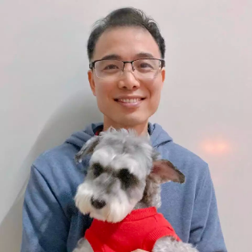
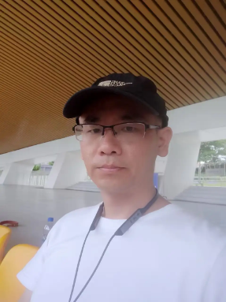
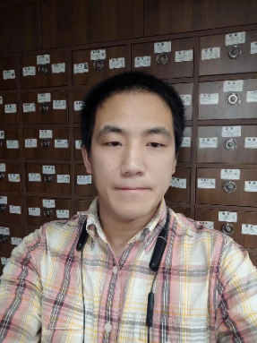

# Opening【班会】

2024-01-22 Contents：

[⭐1 我们是谁？](#1-我们是谁)
[⭐2 通过本次课程你将收获什么？](#2-通过本次课程你将收获什么)
[⭐3 本次学习的具体安排？](#3-本次学习的具体安排)
[⭐4 自我介绍环节](#4-自我介绍环节)

---

## 1 我们是谁?

### 1.1 公司介绍

>👉 **【知乎】** 是一个中文互联网高质量的问答社区和创作者聚集的原创内容平台，于2011年1月正式上线，以“让人们更好地分享知识、经验和见解，找到自己的解答”为品牌使命。截至2020年12月，上的总问题数超过4400万条，总回答数超过2.4亿条，年访问人次超过30亿。知乎是中国互联网首家港股和美股双重上市公司。

>👉 **【知乎｜知学堂】** ，成人职业教育部门，教育业务围绕着社区的内容属性，主要针对成年人提供多种形式的职业教育内容。定位于为成年人群提供知识产品的学习平台，目前上线的课程涉及软考、考研、职场提升等领域。共计服务全国超过百万学员，学员的学习成效和口碑位居行业前列，学员遍及世界各地。

>👉 知学堂 **【AI 大模型全栈工程师】** 课程，同样谨记将用户价值放在第一位，希望通过我们的努力，让更多的学员能够在工作方面有所建树👍

### 1.2 教师介绍

🎊咱们本次课程采用 **【三师教学模式】**，分为授课老师+助教老师+班主任老师

* [【授课老师】](#121-授课老师)负责直播课，直播可以跟老师互动🎗🎗🎗
* [【助教老师】](#122-助教老师)问题答疑，消化每天的学习内容🎈🎈🎈
* [【班主任老师】](#123-班主任老师)也就是我，负责在课后给大家进行学习指引🎊🎊🎊


#### 1.2.1 授课老师

<div class="card card-paddingtop">
    <div align="center"></div>
    <div align="center"><b>孙老师</b></div>

>👉哈尔滨工业大学硕士，软件工程、操作系统、互联网产品、计算机教育专家
>
>👉他就是AI全栈，商业和资本经验丰富，牵头创业基础大模型公司，和李某复、王某文、王某川等大佬同台竞技，一个月时间独立开发的大模型评测软件[ChatALL.ai](https://github.com/sunner/ChatALL)，成为GitHub全球热榜第一，是有实战和影响力的开发者

>**历任：**
>* 融资10+亿在线教育独角兽公司合伙人、首席产品官、CTO
>* 得到App副总裁
>* 网易教育事业部战略总监、首席产品架构师
>* 哈尔滨工业大学副教授
>
>**成果：**
>* 国家级教学成果奖二等奖
>* 校级十大最受学生欢迎的教师 
>* 网易云课堂、中国大学MOOC、得到训练营创始团队核心
>* 世界首个纯在线计算机系缔造者
>* 国内首个教育中台系统负责人
>* 曾在Github中国程序员排名前40
</div>

<div class="card card-paddingtop">
    <div align="center"></div>
    <div align="center"><b>王老师</b></div>

>👉英国伦敦大学学院博士，国际知名学者、企业家，师从统计机器学习理论奠基人之John Shawe-Taylor教授，是最早从事人机对话研究的华裔学者之一
>
>👉他就是AI全栈，仍在研发一线，单人销售、售前、开发、实施全流程交付多个数百万金额AI项目，全栈实战经验丰富，且还能坚持亲自发表顶级国际会议论文

>**历任：**
>* 三角兽科技创始人、CEO，完成5轮总计1.9亿人民币融资，后被腾讯收购
>* 百度度秘中控决策组技术负责人
>* 东芝欧洲研究院对话系统组技术负责人
>* 赫瑞瓦特大学研究员
>* 伦敦大学学院副研究员
>
>**成绩和荣誉：**
>* 北京市特聘专家
>* “凤凰计划”海外高层次人才 
>* 第九届吴文俊人工智能科技进步三等奖
>* 发表论文30余篇
>* 专利授权10余件
>* 2017年度中国大数据企业风云人物
>* 2017中国信息化杰出人物
>* 第十届创业中国年度人物
</div>


#### 1.2.2 助教老师
<div class="card card-paddingtop">
    <div align="center"></div>
    <div align="center">助教<b>西树老师</b></div>
    <div align="center"><i>十年开发经验，擅长前端及公司技术选型</i></div>

>👉拥有近十年开发经验，7年带团队经验，从事web开发多年，前端、后端、服务架构都有涉猎，经历过大公司、创业公司，擅长前端及公司技术选型，拥有丰富的中后台开发经验，精通React技术栈，对前端生态有深入的研究，对服务架构方面，负载均衡，mysql主从复制，k8s、docker有颇深研究。
</div>

<div class="card card-paddingtop">
    <div align="center"></div>
    <div align="center">助教<b>林晓鑫老师</b></div>
    <div align="center"><i>2009年毕业于哈尔滨工业大学</i></div>

>👉硕士方向：机器学习与智能接口 先后就业于新浪，腾讯等游戏公司，有过亿用户服务的处理经验，对人工智能和游戏结合有深入的研究。
</div>


<div class="card card-paddingtop">
    <div align="center"></div>
    <div align="center">助教<b>刘桐老师</b></div>
    <div align="center"><i>6年AI系统研发与工程优化的经验</i></div>

>👉带团队研发与交付过诸多CV与NLP算法工程落地的项目，熟悉AI系统服务编排与稳定性保障相关的技术，擅长异构计算和专用芯片算法模型移植
</div>

<div class="card card-paddingtop">
    <div align="center"></div>
    <div align="center">助教<b>千山老师</b></div>

>👉大模型课程的二期学员，10年以上前端和后端开发经验，精通NodeJs， React技术栈，比较擅长前端和大模型结合做应用开发，目前正在探索全栈大模型独立开发，有兴趣的同学可以关注我的博客和B站。

>个人作品，已经上线，感兴趣的同学可以关注～：[谷歌AI电子表格助手](https://www.sheet-chat.site/)  
>也在尝试做自媒体：[知乎博客](https://zhuanlan.zhihu.com/p/661550350) | [B站](https://www.bilibili.com/video/BV1vW4y1w7BG/)
</div>

<div class="card card-paddingtop">
    <div align="center"></div>
    <div align="center">助教<b>老拐老师</b></div>

>👉十余年开发经验，多年团队管理经验，有Java / PHP / Golang / Node.js / Openresty / Python /C# / Vue / React 等多语言多环境项目工业实践，创过业，卷过大厂，擅长软件架构设计，项目管理，微服务设计及实现
</div>

<div class="card card-paddingtop">
    <div align="center"></div>
    <div align="center">助教<b>于滢涛老师</b></div>
    <div align="center"><i>毕业于华中科技大学</i></div>

>👉曾任职教育独角兽公司技术总监，对于后端，前端，运维均有深刻的理解。
>👉在学生时代与人工智能结缘，现正致力于大模型与教育，健康等行业的结合。
</div>

<div class="card card-paddingtop">
    <div align="center"></div>
    <div align="center">助教<b>科长</b></div>

>👉港理工硕士，15年互联网老兵，初中开始写算法，国内最早一批用CUDA写AI的程序员。后端写的多，前端写得少。做过千万DAU App，带过千万营收业务线。12年管理经验，最多管过200-600人产研团队。个人开发者、量化交易员、3岁半孩子奶爸。伪文青，爱好单机游戏。
</div>

<div class="card warning">
<b>Notes ： </b>大家日常学习中遇到课程问题，可以首选<b>@助教-xx老师</b>，与助教老师积极的探讨与交流奥✌️✌️✌️
</div>

#### 1.2.3 班主任老师
<div class="card">
<div align="center"><b>班班</b></div>
<div align="center"><i>负责我们学习 (拉大家进群的班班老师)</i></div>

> 负责咱们日常上课的问题～😊 💪在未来的时间里我们将会和大家一起成长！一起进步！
</div>

---

## 2 通过本次课程你将收获什么

* 🔥用 AI 思维拆解业务需求的能力
* 🔥独立训练大模型的能力
* 🔥用最优方案独立开发AI 产品的能力
* 🔥用 AI提升 50+%个人工作效率的能力

> 🌈本次课程将用**10周**时间，全方位课程服务，为你保驾护航！🌺🌺🌺
>
> ☀在这10周的课程当中，老师将会带你走进独特的AI课堂，做 ChatGPT浪潮中的超级个体，手把手带你fine-tune 大模型全面,掌握大被型应用开发框架LangChain，解锁 AI 编程能力，秒做技术总监，从设计到变付，体验大模型应用开发落地全流程🍂🍂🍂

---

## 3 本次学习的具体安排

<div class="card card-paddingtop warning">
🎄大家提前了解学习安排，能够更好的学习。

👇老师在这里**强调2点**：

1. 养成看【群公告】的好习惯，学习群内有很多跟我们课程相补充的学习内容，课上学习课下巩固，全面提升~
2. 每周二周四晚20:00-22:00直播是重中之重，一定按时听课。课前我会在班级群中发送上课链接，遇到任何问题都可以【@】或【私聊】自己的班班进行解决🌸🌸🌸
遇到特殊情况班班也会提前告知。
</div>


💗**上课方式**有以下两种 (班班推荐咱们用电脑端哈，界面效果会更好一些)：
1. **手机端**：下载知学堂APP上课
2. **PC端**：登陆知乎官网点击[知学堂](https://www.zhihu.com/education/learning)板块


---

## 4 自我介绍环节
大家可以在群内按照如下自我介绍模版发送自己的自我介绍：
```

【你擅长的编程语言】：
【工作时长】：
【地区】：
【行业/职业】：
【你最希望在本次课程中学到什么？】：
```


<!-- 
<style>
    .card {
        border: 1px solid #ebeef5;
        background-color: #fff;
        color: #303133;
        border-radius: 15px;
        box-shadow: 0 2px 12px 0 rgba(0,0,0,.1);
        padding:0px 5px 0px 5px;
        margin:15px 0px 15px 0px;
    }
    .card-paddingtop {
        padding-top:15px;
    }
    .warning {
        color: #e96115;
        border-color: #e65100;
        background-color:#ffe0b2;
    }
</style>
-->